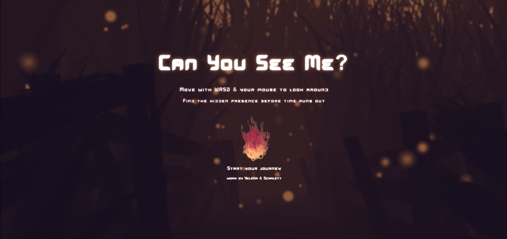
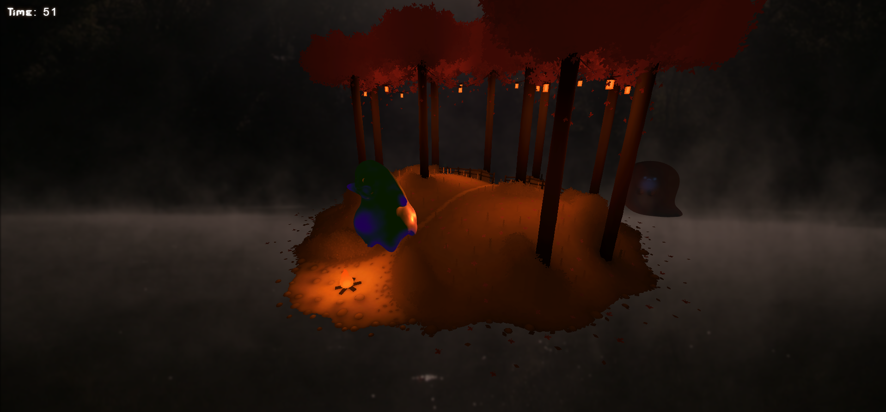

# 263_p2_ys

Shared repository for project 2 ( Yéléna and Scarlett )

# **Can You See Me?** is a dark 3D game where you explore a forest and try to find a hidden presence before time runs out. You move around and use clues to get closer and reveal where it is.

#

# Forest Model

"Forest Lighting" (https://skfb.ly/oCsyH) by Ti Mur is licensed under CC Attribution-NonCommercial-ShareAlike (http://creativecommons.org/licenses/by-nc-sa/4.0/).

# Avatar Models

Avatar 1: (https://sketchfab.com/3d-models/chubby-ghost-753c85362d7446169f1b30d6a2c26d34) by Elyse Darbyis liscensed under CC Attirbution (https://creativecommons.org/licenses/by/4.0/)

Avatar 2:(https://sketchfab.com/3d-models/ghost-of-tsushiito-7ea51fcaff5b4ad08d59b306118083ec) by aaroncruz70500 is licensed under CC Attribution-NonCommercial-ShareAlike (http://creativecommons.org/licenses/by-nc-sa/4.0/).

